# 1C Metacode MCP Server

Загружает метаданные конфигураций 1С в графовую базу данных и предоставляет инструменты MCP для запросов по графу.

#### Основные возможности

- Загрузка всех метаданных конфигураций 1С в графовую базу Neo4j из отчета по конфигурации 
- Загрузка данных управляемых форм - реквизиты/элементы формы.
- Загрузка предопределенных значений и прав ролей.
- Широкая связность объектов метаданных: в реквизитах, в элементах управлениях формы, в регистрах накопления/сведений, в правах доступа. 
- MCP инструменты: search_metadata
- Поддержка загрузки и поиска информации по несколким конфигурациям (проектам). При поиске не нужно указывать в каком проекте искать. Система автоматически фильтрует. 
- Возможность осуществлять поиск как с помощью LLM (режим агента, который переводить запрос на естественом языке в cypher запрос), так и без LLM (поиск по шаблонам). Большинство информации может быть найдено по шаблонам. 


#### Структура данных

```mermaid
graph TB
    %% Компактная вертикальная структура
    Project(["Project<br/>Проект"]) -->|"contains"| Configuration(["Configuration<br/>Конфигурация"])
    Configuration -->|"has"| MetadataCategory(["MetadataCategory<br/>Категория метаданных"])
    MetadataCategory -->|"contains"| MetadataObject(["MetadataObject<br/>Объект метаданных"])
    
    %% Формы и интерфейс (левая колонка)
    MetadataObject -->|"HAS_FORM"| Form(["Form<br/>Форма"])
    Form -->|"HAS_CONTROL"| FormControl(["FormControl<br/>Элемент формы"])
    Form -->|"HAS_EVENT"| FormEvent(["FormEvent<br/>Событие формы"])
    Form -->|"HAS_FORM_ATTRIBUTE"| FormAttribute(["FormAttribute<br/>Атрибут формы"])
    FormControl -->|"HAS_EVENT"| FormControlEvent(["FormEvent<br/>Событие элемента"])
    FormEvent -->|"HAS_HANDLER"| EventHandler(["Routine<br/>Обработчик события"])
    FormControlEvent -->|"HAS_HANDLER"| ControlEventHandler(["Routine<br/>Обработчик события"])
    
    %% Данные и атрибуты (правая колонка)
    MetadataObject -->|"HAS_ATTRIBUTE"| Attribute(["Attribute<br/>Атрибут"])
    MetadataObject -->|"HAS_TABULAR_PART"| TabularPart(["TabularPart<br/>Табличная часть"])
    MetadataObject -->|"HAS_RESOURCE"| Resource(["Resource<br/>Ресурс"])
    MetadataObject -->|"HAS_DIMENSION"| Dimension(["Dimension<br/>Измерение"])
    TabularPart -->|"HAS_ATTRIBUTE"| TabularAttribute(["Attribute<br/>Атрибут табл. части"])
    
    %% Связи и зависимости (нижняя секция)
    MetadataObject -->|"USED_IN"| UsedInTarget(["Target Object<br/>Целевой объект"])
    MetadataObject -->|"DO_MOVEMENTS_IN"| RegisterObject(["Register<br/>Регистр"])
    MetadataObject -->|"GRANTS_ACCESS_TO"| AccessTarget(["Access Target<br/>Цель доступа"])
    
    %% Модули и код (вертикальная цепочка)
    MetadataObject -->|"HAS_MODULE"| Module(["Module<br/>Модуль"])
    Module -->|"DECLARES"| Routine(["Routine<br/>Процедура/Функция"])
    Routine -->|"CALLS"| CalledRoutine(["Called Routine<br/>Вызываемая процедура"])
    
    %% Дополнительные компоненты (компактно)
    MetadataObject -->|"HAS_COMMAND"| Command(["Command<br/>Команда"])
    MetadataObject -->|"HAS_URL_TEMPLATE"| UrlTemplate(["UrlTemplate<br/>Шаблон URL"])
    MetadataObject -->|"HAS_EVENT_SUBSCRIPTION"| EventSubscription(["EventSubscription<br/>Подписка на событие"])
    MetadataObject -->|"HAS_PREDEFINED"| PredefinedItem(["PredefinedItem<br/>Предопределенный элемент"])
    
    %% Связи HTTP и форм (компактно)
    UrlTemplate -->|"HAS_URL_METHOD"| UrlMethod(["UrlMethod<br/>Метод URL"])
    UrlMethod -->|"HAS_HANDLER"| UrlHandler(["Routine<br/>Обработчик HTTP"])
    FormControl -->|"BINDS_TO"| BindTarget(["Bind Target<br/>Цель связывания"])
    FormControl -->|"LINKS_TO_COMMAND"| LinkedCommand(["Command<br/>Команда"])
    
    %% Стили с уникальными цветами
    classDef projectClass fill:#FF6B6B,stroke:#C92A2A,stroke-width:2px,color:#FFFFFF
    classDef configClass fill:#4ECDC4,stroke:#26A69A,stroke-width:2px,color:#FFFFFF
    classDef categoryClass fill:#45B7D1,stroke:#1976D2,stroke-width:2px,color:#FFFFFF
    classDef objectClass fill:#96CEB4,stroke:#388E3C,stroke-width:2px,color:#FFFFFF
    classDef formClass fill:#FFEAA7,stroke:#FD8D3C,stroke-width:2px,color:#000000
    classDef commandClass fill:#DDA0DD,stroke:#7B68EE,stroke-width:2px,color:#FFFFFF
    classDef moduleClass fill:#98D8C8,stroke:#16A085,stroke-width:2px,color:#FFFFFF
    classDef tabularClass fill:#F7DC6F,stroke:#F39C12,stroke-width:2px,color:#000000
    classDef predefinedClass fill:#BB8FCE,stroke:#8E44AD,stroke-width:2px,color:#FFFFFF
    classDef attributeClass fill:#85C1E9,stroke:#2980B9,stroke-width:2px,color:#FFFFFF
    classDef resourceClass fill:#F8C471,stroke:#E67E22,stroke-width:2px,color:#000000
    classDef dimensionClass fill:#82E0AA,stroke:#27AE60,stroke-width:2px,color:#FFFFFF
    classDef routineClass fill:#F1948A,stroke:#E74C3C,stroke-width:2px,color:#FFFFFF
    classDef formControlClass fill:#AED6F1,stroke:#3498DB,stroke-width:2px,color:#FFFFFF
    classDef formEventClass fill:#D7BDE2,stroke:#8E44AD,stroke-width:2px,color:#FFFFFF
    classDef formAttrClass fill:#A3E4D7,stroke:#1ABC9C,stroke-width:2px,color:#000000
    classDef urlTemplateClass fill:#F9E79F,stroke:#F1C40F,stroke-width:2px,color:#000000
    classDef urlMethodClass fill:#D98880,stroke:#CD6155,stroke-width:2px,color:#FFFFFF
    classDef eventSubClass fill:#AEB6BF,stroke:#5D6D7E,stroke-width:2px,color:#FFFFFF
    classDef targetClass fill:#CACFD2,stroke:#7F8C8D,stroke-width:2px,color:#000000
    
    %% Применение цветов
    class Project projectClass
    class Configuration configClass
    class MetadataCategory categoryClass
    class MetadataObject objectClass
    class Form,FormAttribute formClass
    class Command commandClass
    class Module moduleClass
    class TabularPart tabularClass
    class PredefinedItem predefinedClass
    class Attribute,TabularAttribute attributeClass
    class Resource resourceClass
    class Dimension dimensionClass
    class Routine,CalledRoutine,EventHandler,ControlEventHandler,UrlHandler routineClass
    class FormControl formControlClass
    class FormEvent,FormControlEvent formEventClass
    class UrlTemplate urlTemplateClass
    class UrlMethod urlMethodClass
    class EventSubscription eventSubClass
    class UsedInTarget,RegisterObject,AccessTarget,BindTarget,LinkedCommand targetClass
```




Пока не полностью реализована.  Отсутвуют модули и прооцедуры/функции.


#### Быстрый старт

- Docker и Docker Compose
- Свободные порты 7474/7687 (Neo4j) и 6001 (MCP)

1. Подготовьте .env

   Скопируйте пример и заполните значения (минимум пароль Neo4j):
   
   Обязательно задайте пароль Neo4j
    NEO4J_PASSWORD=...
   
   В файле .env указываются значение, которые общие для всех контейнеров. 
   Значения, которые различаются для каждого контейнера лучше указывать непосредственно в docker-compose.yml


2. Подготовьте docker-compose.yml

   Скопируйте пример docker-compose.example.yml в туже папку где у вас файл .env и переименуйте в docker-compose.yml 
   
   Задайте PROJECT_NAME в сервисе 1c-metacode-prj1 (можно переименовать название сервиса как нравится) 
   Если у вас только один проект, то второй сервис 1c-metacode-prj2 можно удалить полностью
   Если нужно больше двух то продублируйте секцию сервиса и обязательно задайте  другой порт на хосте ( меняем только первый порт в этой строке "6001:6001")  и другой PROJECT_NAME


3. Разместите данные

   В корне папки где располагаются файлы .env и docker-compose.yml  создайте структуру для монтирования в контейнер:
   
   - ./data/prj1/metadata — Выгрузка отчет по конфигурации в формате .txt (в папке должен быть только один txt файл). В конфигураторе Конфигурация -> Отчет по конфигурации (в текстовый файл, Вся конфигурация)
   - ./data/prj1/code — Выгрузка конфигурации в файлы. В конфигураторе Конфигурация -> Выгрузить конфигурацию в файлы (XML-файлы)
   
   Аналогично по другим проектам:
   
   - ./data/prj2/metadata 
   - ./data/prj2/code

4. Запуск

```
docker compose up -d
```

#### Сервисы

- Neo4j: http://localhost:7474 (логин neo4j / пароль из NEO4J_PASSWORD)
- Bolt: bolt://localhost:7687
- MCP сервер: http://localhost:6001/mcp (и другие порты, указанные в docker-compose.yml)

#### Логи приложения

```
docker compose logs -f 1c-metacode-prj1
```

#### Первичный запуск

- Приложение создаст индексы в Neo4j
- Проведёт загрузку метаданных из ./data/metadata/*.txt
- При включённых флагах — просканирует ./data/code и догрузит формы/предопределённые значения/права
- Загрузка всех данных занимает около 15 минут для типовой конфигурации Бухгалтерия (может увеличиться если слабый компьютер)  

#### Обновление/перезагрузка данных

- Для полной перезагрузки данных проекта установите в docker-compose.yml переменную для соответсвующего проекта и перезапустите контейнер:

```
FULL_METADATA_RELOAD=true
docker compose restart 1c-metacode-prj1
```

#### Инструменты MCP

Сервер публикует 2 инструмента:
- search_metadata(query: str) — точные запросы к графу метаданных 1С (через внутренний шаблон/LLM агент)
- metadata_search_guide() — динамическая подсказка по формированию запросов

Транспорт:
- По умолчанию streamable-http (HTTP путь /mcp)
- При MCP_USE_SSE=true — SSE-режим

Подключение клиентов
Используйте любой MCP-совместимый клиент (например, IDE/агенты с поддержкой OpenAI MCP). Укажите:
- transport: streamable-http или sse
- endpoint: http://localhost:6001/mcp

Пример mcp.json для Cline

```
{
  "mcpServers": {
    "1c-metacode": {
      "url": "http://localhost:6011/mcp",
      "connection_id": "1c_metacode_service_001",
      "alwaysAllow": [],
      "type": "streamable-http",
      "timeout": 300
      
    }
  }
}
```

#### Обновление 

Для обновления на новую версию приложения 

```
docker compose pull

docker compose up -d --force-recreate
```

Если нужно начать всё с нуля и удалить полностью базу то выполните

```
docker compose down --volumes
docker compose up -d --force-recreate
```


